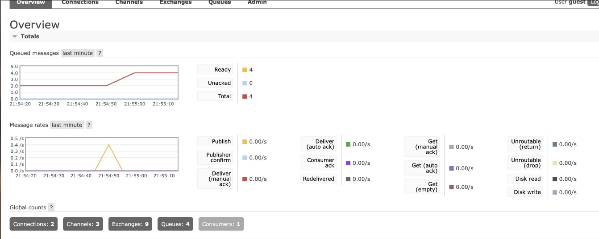
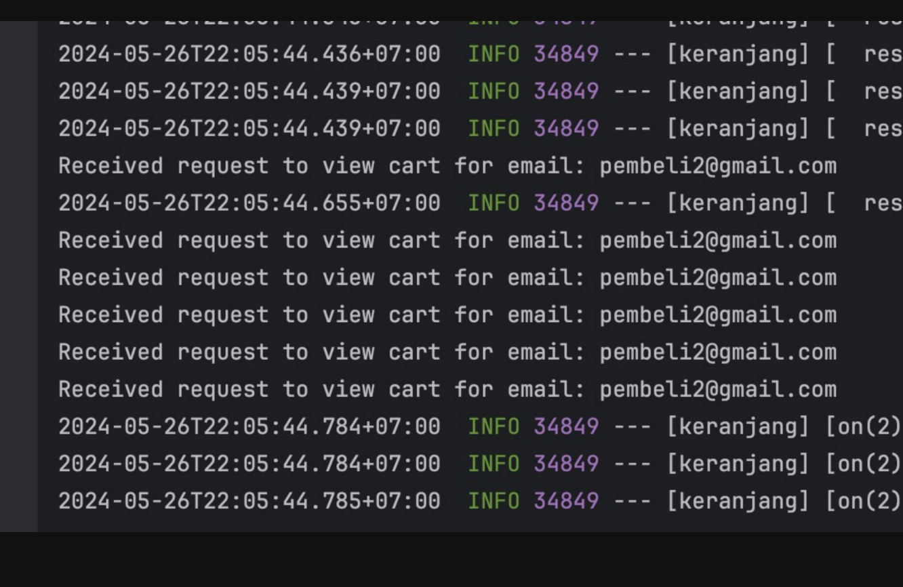

Modul Pengelolaan Keranjang Belanja (🙋)

Pembeli mempunyai fungsi keranjang belanja agar dapat menambah, mengubah jumlah, atau menghapus item game sebelum checkout.

Integrasi sistem keranjang belanja dengan manajemen stok game untuk memastikan ketersediaan barang yang akurat sebelum transaksi dilakukan.

Berikut adalah penggunaan rabbitMQ untuk subscriber dan publisher dengan modul user merequest keranjang

terlihat pada gambar tersebut request dari user diterima dan modul saya mendapat respon tersebut dan mengembalikan string pada pengguna yang merequest